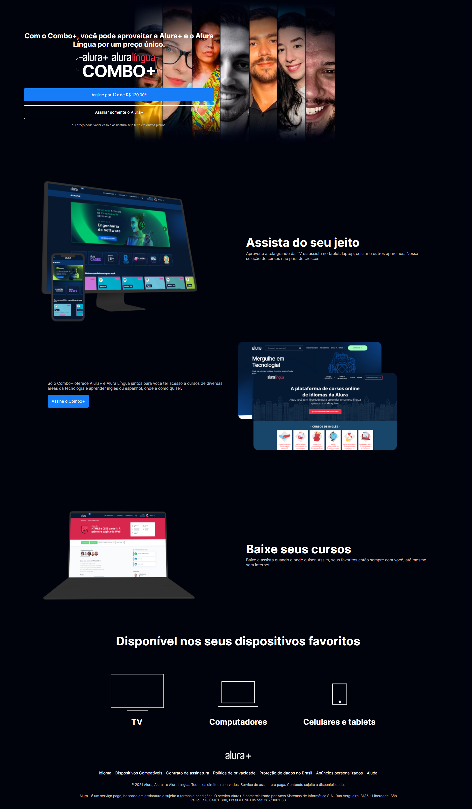

<h1 align="center"> Alura Plus </h1>
 

<h2 align="center"> Descrição do Projeto </h2>
 
    Projeto desenvolvido para demonstrar os conhecimentos adquiridos no curso "HTML E CSS: praticando HTML/CSS" , presente no site na Alura.

 

<h2 align="center"> :hammer:  Ferramentas e Funcionalidades  :hammer: </h2>
 

 
          
<h2 align="center"> :notebook:  Estou aprendendo  :notebook:</h2>

- Alinhar Elementos com o CSS
- Usar transições e subclasses no CSS
- Utilizar o GitHub

 
 
<h2 align="center"> :heart:  Contato  :heart:</h2>
 

regothardo@gmail.com

          

